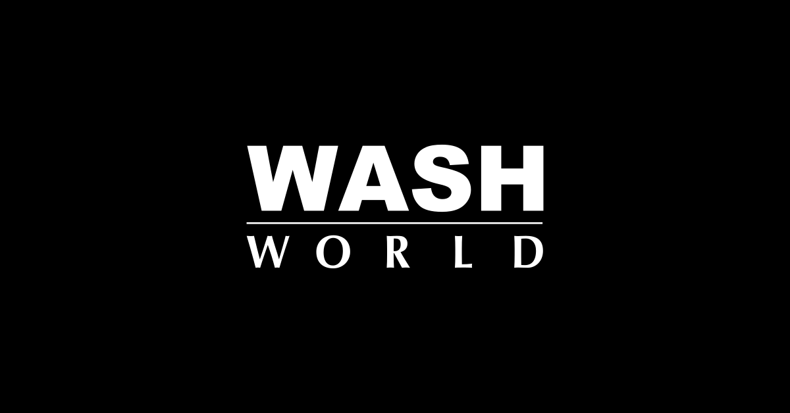

<p align="center">
  <a href="http://washworld.dk/" target="blank"></a>
</p>

# Washworld App - Expo/React-Native

WashWorld is a React Native application designed to simplify the process of booking car wash services. It allows users to schedule car washes in real-time and customize their service options through an intuitive mobile interface.

## Features

- **Real-Time Booking**: Schedule car washes instantly at your convenience.
- **Service Customization**: Choose from a variety of car wash options to meet your specific needs.
- **User-Friendly Interface**: Navigate the app with ease for a seamless user experience.


## Setup

To run this application locally, follow these steps:

1. **Clone the repository to your local machine:**

   ```bash
   git clone <repository_url>
   ```

2. **Navigate to the project directory:**

   ```bash
   cd <project_directory>
   ```

3. **Create a .env file in the root directory of the project with the following content:**

   ```env
   HOST=<your_ip_address>
   ```

   Replace `<your_ip_address>` with your actual ip address found by running `ipconfig` or `ifconfig`.

4. **Install Dependencies:** Navigate to the project directory and install dependencies by running:

   ```bash
   npm install
   ```

5. **Run the Application:** Start the development server by running:

   ```bash
   npx expo start
   ```

6. **Run on iOS/Android:** Use Expo CLI or your preferred method to run the application on iOS or Android devices/emulators.

## Contributing

Contributions are welcome! If you'd like to contribute to this project, please follow these steps:

1. Fork the repository.
2. Create your feature branch:

   ```bash
   git checkout -b feature/YourFeature
   ```

3. Commit your changes:

   ```bash
   git commit -am 'Add some feature'
   ```

4. Push to the branch:

   ```bash
   git push origin feature/YourFeature
   ```

5. Create a new Pull Request.

Please ensure your code adheres to the existing code style and conventions. Also, make sure to update the README with details of changes to the interface, including new environment variables, exposed ports, and useful file locations.

## License

This project is licensed under the MIT License.

## Acknowledgements

- This project was made possible thanks to the wonderful community and resources available for React Native development.
- Special thanks to contributors who have helped improve and maintain this project.

Feel free to reach out with any questions, feedback, or suggestions. Happy washes!
